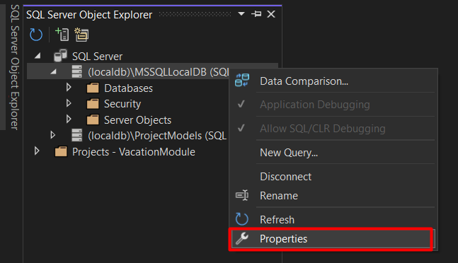

# VacationModule
  
  

## Description

RESTful API vacation module that lets users fill in the dates for
their vacation days. It takes into consideration the working days of the week as
well as the national holidays. Each user should start from 25 available vacation days per
year.

## Projects

The solution implements the arhitectural pattern of Clean Arhitecture. The main advantages are:
* **Separation of concerns:** The architecture promotes separation of concerns between the different layers of the application, making it easier to maintain and test.

* **Testability:** The architecture makes it easier to write automated tests, since the different layers can be tested independently.

* **Flexibility:** The architecture allows for changes to be made to one layer without affecting the others, making the application more flexible and adaptable.

* **Scalability:** The architecture allows for the application to be scaled horizontally or vertically, since each layer can be scaled independently.
### VacationModule.API

This project is the main web API application that serves the vacation module. It has dependencies on `VacationModule.Core` and `VacationModule.Infrastructure` projects. The `VacationModule.API` project is built using ASP.NET Core and follows the RESTful API architectural style. Swagger documentation is available. `DateOnlyTimeOnly.AspNet.Swashbuckle` package is used to use the correct format for `DateOnly` type in the Swagger documentation because it is a fairly new data type and it is not yet supported.

### VacationModule.Core

This project contains the application layer logic for the vacation module. It contains the business logic and handles the communication between the infrastructure layer and the domain layer. The `VacationModule.Core` project is independent of other projects.

* #### VacationModule.Core.Domain

  This project contains the domain layer logic for the vacation module. It defines the entities, value objects, and interfaces that are used throughout the module. And it is a sub-layer of the Core layer.

### VacationModule.Infrastructure

This project contains the data access layer for the vacation module. It contains the implementations of the repository interfaces defined in the domain layer. This project also includes the configuration for Entity Framework Core and the database context. The `VacationModule.Infrastructure` project is dependent on the `VacationModule.Core.Domain` project and uses the `Microsoft.EntityFrameworkCore.SqlServer` and `Microsoft.EntityFrameworkCore.Tools` packages.

### VacationModule.ServiceTests

This project contains the unit tests for the services in the `VacationModule.Core` project. It uses the `Moq` library for mocking dependencies and the `coverlet.collector` package for code coverage reporting. The `VacationModule.ServiceTests` project is built using `xUnit.net`.

### VacationModule.IntegrationTests

This project contains the integration tests for the `VacationModule.API` project. It uses the `Microsoft.AspNetCore.Mvc.Testing` package for testing the HTTP endpoints and the `Microsoft.EntityFrameworkCore.InMemory` package for testing the database. The `VacationModule.IntegrationTests` project is built using `xUnit.net`.

### VacationModule.ControllerTests

This project contains the unit tests for the controllers in the `VacationModule.API` project. It uses the `Moq` library for mocking dependencies and the `coverlet.collector` package for code coverage reporting. The `VacationModule.ControllerTests` project is built using `xUnit.net`.


## Technologies Used

* C# .NET 7
* SQL Server


## Installation

Make sure you have [`.NET 7.0`](https://dotnet.microsoft.com/en-us/download/dotnet/7.0) installed. You can open a termnial and run the `dotnet --info` command to check it.

 1. [Install Visual Studio 2022](https://visualstudio.microsoft.com/vs/)
 2. Open `VacationModule.sln` in Visual Studio
 3. Go to `Tools` &rarr; `NuGet Package Manager` &rarr; `Manage NuGet Packages for Solution`

 <p align = "center">
  
 </p>

 4. Click on `Browse` to search for packages, you can choose for what project to install the package and which `version`. Make sure to install the specified version in order to avoid unexpected behaviour.
  <p align = "center">
  
 </p>
#### NuGet Packages

* DateOnlyTimeOnly.AspNet.Swashbuckle 2.2.1
  * Short description: A tool to generate Swagger documentation for ASP.NET Core Web APIs.
  * [Link to package page](https://www.nuget.org/packages/Swashbuckle.AspNetCore/)
  * Install for: `VacationModule.Core` `VacationModule.API`

* Swashbuckle.AspNetCore 6.4.0
  * Short description: A library for generating Swagger documents for ASP.NET Core web APIs that use DateOnly and TimeOnly types.
  * [Link to package page](https://www.nuget.org/packages/DateOnlyTimeOnly.AspNet.Swashbuckle/)
  * Install for: `VacationModule.API`

* Microsoft.AspNetCore.Identity.EntityFrameworkCore 7.0.3
  * Short description: ASP.NET Core Identity provider using Entity Framework Core.
  * [Link to package page](https://www.nuget.org/packages/Microsoft.AspNetCore.Identity.EntityFrameworkCore/)
  * Install for: `VacationModule.Core` `VacationModule.API` `VacationModule.Infrastructure`

* ErikEJ.EntityFrameworkCore.SqlServer.DateOnlyTimeOnly 7.0.1
  * Short description: Adds support for the DateOnly and TimeOnly types in Entity Framework Core using Microsoft SQL Server.
  * [Link to package page](https://www.nuget.org/packages/ErikEJ.EntityFrameworkCore.SqlServer.DateOnlyTimeOnly/)
  * Install for: `VacationModule.API`

* Microsoft.AspNetCore.OpenApi 7.0.3
  * Short description: Provides a set of services to generate Swagger documents for an API, and also provides a set of middleware to expose that Swagger document as JSON and HTML.
  * [Link to package page](https://www.nuget.org/packages/Microsoft.AspNetCore.OpenApi/)
  * Install for: `VacationModule.API`

* Microsoft.EntityFrameworkCore.Design 7.0.3
  * Short description: Shared design-time components for Entity Framework Core tools.
  * [Link to package page](https://www.nuget.org/packages/Microsoft.EntityFrameworkCore.Design/)
  * Install for: `VacationModule.API`

* Microsoft.EntityFrameworkCore.SqlServer 7.0.3
  * Short description: Entity Framework Core provider for Microsoft SQL Server.
  * [Link to package page](https://www.nuget.org/packages/Microsoft.EntityFrameworkCore.SqlServer/)
  * Install for: `VacationModule.API` `VacationModule.Infrastructure`

* Microsoft.EntityFrameworkCore.Tools 7.0.3
  * Short description: Command-line tools for Entity Framework Core.
  * [Link to package page](https://www.nuget.org/packages/Microsoft.EntityFrameworkCore.Tools/)
  * Install for: `VacationModule.Infrastructure`

* Microsoft.NET.Test.Sdk 17.3.2
  * Short description: The MSBuild SDK that includes the .NET Core unit test runner and code coverage support.
  * [Link to package page](https://www.nuget.org/packages/Microsoft.NET.Test.Sdk/)
  * Install for: `VacationModule.ControllerTests` `VacationModule.ServiceTests` `VacationModule.IntegrationTests`
* Moq 4.18.4
  * Short description: The most popular and friendly mocking framework for .NET.
  * [Link to package page](https://www.nuget.org/packages/Moq/)
  * Install for: `VacationModule.ControllerTests` `VacationModule.ServiceTests` 

* xunit 2.4.2
  * Short description: A free, open source, community-focused unit testing tool for the .NET Framework.
  * [Link to package page](https://www.nuget.org/packages/xunit/)
  * Install for: `VacationModule.ControllerTests` `VacationModule.ServiceTests` `VacationModule.IntegrationTests`

* xunit.runner.visualstudio 2.4.5
  * Short description: Test runner for Visual Studio.
  * [Link to package page](https://www.nuget.org/packages/xunit.runner.visualstudio/)
  * Install for: `VacationModule.ControllerTests` `VacationModule.ServiceTests` `VacationModule.IntegrationTests`

* Microsoft.AspNetCore.Mvc.Testing 7.0.3
  * Short description: Test framework for ASP.NET Core web applications.
  * [Link to package page](https://www.nuget.org/packages/Microsoft.AspNetCore.Mvc.Testing/)
  * Install for: `VacationModule.IntegrationTests`
* Microsoft.EntityFrameworkCore.InMemory 7.0.3
  * Short description: In-memory database provider for Entity Framework Core.
  * [Link to package page](https://www.nuget.org/packages/Microsoft.EntityFrameworkCore.InMemory/)
  * Install for: `VacationModule.IntegrationTests`

* coverlet.collector 3.1.2
  * Short description: A cross platform code coverage tool for .NET, with support for line, branch and method coverage.
  * [Link to package page](https://www.nuget.org/packages/coverlet.collector/)
  * Install for: `VacationModule.ControllerTests` `VacationModule.ServiceTests` `VacationModule.IntegrationTests`
###
   Press `Ctrl`+`Shift`+`B` to `Build` the solution. Some packages depend on other packages and it should have installed everything you need, but in case the build fails it might ask you to install some more packages.
##### Setting up the databse:
<center>

Click on `View` &rarr; `SQL Server Object Explorer`.
 <p align = "center">
  
 </p>

 Expand `SQL Server`, `Right Click` on `localdb` and go to `Properties` 

 <p align = "center">
  
 </p>

`General` &rarr; `Connection String` and copy it. 

 <p align = "center">
  
 </p>

</center>

It should be something like:
```
Data Source=(localdb)\MSSQLLocalDB;Initial Catalog=master;Integrated Security=True;Connect Timeout=30;Encrypt=False;TrustServerCertificate=False;ApplicationIntent=ReadWrite;MultiSubnetFailover=False
```
You only need:
```
Data Source=(localdb)\MSSQLLocalDB;Initial Catalog=master;Integrated Security=True;
```
<center>

Go to `VacationModule.API` &rarr; `appsettings.json`

 <p align = "center">
  
 </p>

Replace the `DefaultConnection` string with yours.

 <p align = "center">
  
 </p>

Go to `Tools` &rarr; `NuGet Package Manager` &rarr; `Package Manager Console` 
 <p align = "center">
  
 </p>

`Default Project` &rarr; `VacationModule.Infrastructure`. 

 <p align = "center">
  
 </p>

In the console, write `Update-Database` and hit `Enter`.

 </center>

 Now it will create your databse and seed the `National Holidays` table with the data from `VacationModule.API`\/`nationalholdays.json`.

Press `F5` to run the project.


## API Documentation
Most of the functionality requies authorizaton which means that the first thing you shoud do is to create an account. If you want full access, for the role use `1`, `0` is for employees. Only an admin can add a new national holiday, edit or delete an existing one, or update the year for all existing national holidays. Anyone (even unauthenticated users) can see the list of national holidays. The admin can get all vacation requests or search for the vacations of an individual user. The employee can use all create, get, update, delete operations for his own vacation requests. For each year any user can have maximum 25 vacation days (it doesn't take into account national holidays and weekends). Any user can check how many vacation days he has for a specified year. An user can request a vacation that starts in a year and ends in the next year in the limit of 25 working days per year.  When you register you don't have to log in, you will be logged in automatically.

When you create a vacation request the following constraints are applied:
  * The start date can't be after the end date.
  * If you want one day off, you have to choose the end date equal with the start date.
  * The vacation request can't intersect with your other requests; you can check your request to choose the dates accordingly.


### Endpoints
##
### National Holidays
#####
#
### Create National Holiday [POST /api/admin/national-holidays]
##

This endpoint is used to create a new national holiday. It requires the user to be authorized with the "Admin" role. The endpoint expects a JSON object containing the following properties:
  * `name` (string): Name of the holiday.
  * `holidayDate` (string): Date of the holiday (in format "yyyy-MM-dd").
  
* Example request body:
  ```
  {
    "holidayName": "string",
    "holidayDate": "2023-03-13"
  }
  ```
* Response:
  * 200 OK: The created national holiday, represented as a JSON object with the following fields:
    * `id` (string): Unique identifier of the holiday.
    * `name` (string): Name of the holiday.
    * `holidayDate` (string): Date of the holiday (in format "yyyy-MM-dd").
  * 400 Bad Request: If the `holidayDate` is missing or invalid.

##
### Get National Holidays [GET /api/national-holidays]
##

This endpoint is used to retrieve a list of all national holidays. It does not require any authorization.

* Example response body:
  ```
  [
    {
      "id": "b0568024-46d2-4e5d-a61f-08ccc2acee90",
      "holidayName": "St Mary's Day",
      "holidayDate": "2023-08-15"
    },
    {
      "id": "dc1b5e58-30b2-4dea-bca5-166bc9e799df",
      "holidayName": "Unification Day",
      "holidayDate": "2023-01-24"
    }
  ]
  ```
* Response:
  * 200 OK: List of national holidays, represented as an array of JSON objects with the following fields:
    * `id` (string): Unique identifier of the holiday.
    * `name` (string): Name of the holiday.
    * `holidayDate` (string): Date of the holiday (in format "yyyy-MM-dd").

##
### Edit National Holiday [PUT /api/admin/national-holidays/{Id}]
##

This endpoint is used to update an existing national holiday. It requires the user to be authorized with the "Admin" role. The endpoint expects a JSON object containing the following properties:

* Path parameters:
  * `Id` (string): Unique identifier of the holiday to update.

* Request body: JSON object containing the following fields (all fields are optional):
  * `id` (string): Unique identifier of the holiday to update. (has to match the path parameter)
  * `name` (string): New name of the holiday.
  * `holidayDate` (string): New date of the holiday (in format "yyyy-MM-dd").
  
* Example request body:
  ```
  {
    "id": "3fa85f64-5717-4562-b3fc-2c963f66afa6",
    "holidayName": "string",
    "holidayDate": "2023-03-13"
  }
  ```

* Response:
  * 204 No Content: If the national holiday was successfully updated.
  * 400 Bad Request: If the `id` in the path parameter does not match the `id` in the request body.
  * 404 Not Found: If the national holiday with the specified `id` does not exist.

##
### Update National Holidays to Year [PUT /api/admin/national-holidays/update-to/{year}]
##

This endpoint is used to update all national holidays to a specific year. It requires the user to be authorized with the "Admin" role. The endpoint expects a JSON object containing the following properties:
* Path parameters:
  * `year` (int): Year to update the national holidays to.
  
* Response:
  * 204 No Content: If the national holidays were successfully updated to the given year.
  * 404 Not Found: If there are no national holidays in the system.

##
### Delete National Holiday [DELETE /api/admin/national-holidays/{id}]
##

his endpoint is used to delete an existing national holiday. It requires the user to be authorized with the "Admin" role. The endpoint expects a JSON object containing the following properties:

* Path parameters:
  * `idToDelete` (string): Unique identifier of the holiday to delete.

* Response:
  * 204 No Content: If the national holiday was successfully deleted.
  * 400 Bad Request: If the `id` is missing or invalid.
  * 404 Not Found: If the national holiday with the specified `id` does not exist.

##
### Vacations
###

##
### Create Vacation [POST /api/vacations]
##

This API endpoint allows authenticated users to create a new vacation record. The user must provide a start date and an end date for their vacation. The endpoint expects a JSON object containing the following properties:
  * `startDate` (string): The start date of the vacation, in "yyyy-MM-dd" format.
  * `endDate` (string): The end date of the vacation, in "yyyy-MM-dd" format.
  
* Example request body:
  ```
  {
    "startDate": "2023-03-13",
    "endDate": "2023-03-13"
  }	
  ```
* Response:
  * 201 Created: The vacation request was successfully created.
  * 400 Bad Request: The request body is invalid or missing required properties.
  * 404 Not Found: The user or vacation request was not found.
  * 401 Unauthorized: The user is not authenticated.
  
##
### Create Vacation [POST /api/vacations]
##

This API endpoint allows authenticated users to create a new vacation record. The user must provide a start date and an end date for their vacation. The endpoint expects a JSON object containing the following properties:
  * `startDate` (string): The start date of the vacation, in "yyyy-MM-dd" format.
  * `endDate` (string): The end date of the vacation, in "yyyy-MM-dd" format.
  
* Example request body:
  ```
  {
    "startDate": "2023-03-13",
    "endDate": "2023-03-13"
  }	
  ```
* Response:
  * 201 Created: The vacation request was successfully created.
  * 400 Bad Request: The request body is invalid or missing required properties.
  * 404 Not Found: The user or vacation request was not found.
  * 401 Unauthorized: The user is not authenticated.

  ## To be continued...
  You can see the information for the other endpoints in the Swagger Documentation.
